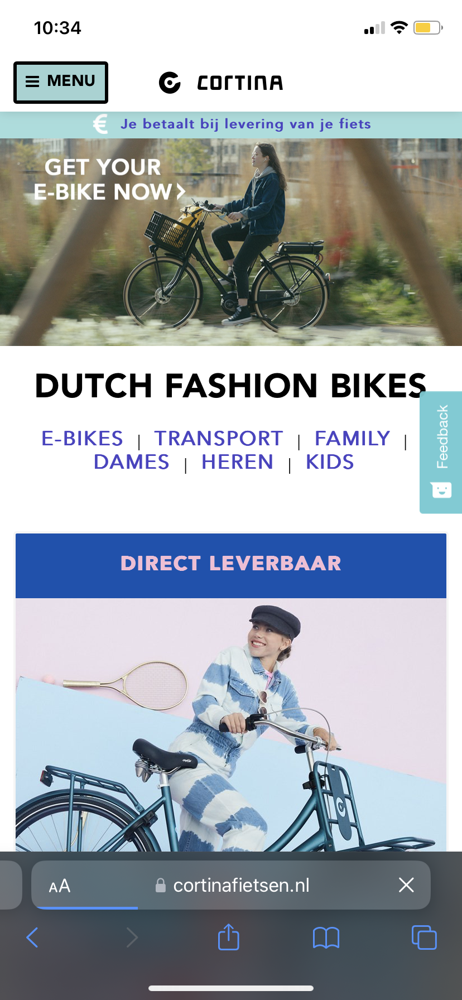
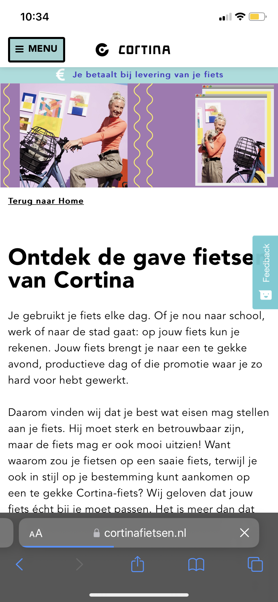

# Procesverslag
Markdown is een simpele manier om HTML te schrijven.  
Markdown cheat cheet: [Hulp bij het schrijven van Markdown](https://github.com/adam-p/markdown-here/wiki/Markdown-Cheatsheet).

Nb. De standaardstructuur en de spartaanse opmaak van de README.md zijn helemaal prima. Het gaat om de inhoud van je procesverslag. Besteedt de tijd voor pracht en praal aan je website.

Nb. Door *open* toe te voegen aan een *details* element kun je deze standaard open zetten. Fijn om dat steeds voor de relevante stuk(ken) te doen.

## Jij

  
uitwerken voor kick-off werkgroep

  ### Auteur:
  Finn Riksman

  #### Je startniveau:
  Blauw/rood

  #### Je focus:
  Surface plane
 

## Je website

  
uitwerken voor kick-off werkgroep

  ### Je opdracht:
  https://www.cortinafietsen.nl/

  #### Screenshot(s) van de eerste pagina (small screen): 
  Home page Cortina
    

  #### Screenshot(s) van de tweede pagina (small screen):
  Inspiratie pagina
  
 

## Toegankelijkheidstest 1/2 (week 1)

  
uitwerken na test in 1e werkgroep

  ### Bevindingen
  Lijst met je bevindingen die in de test naar voren kwamen:
  - Er zijn helemaal geen headings op de beginpagina
  - Alle headings zijn een H2, en een paar H3. Dit geeft geen hiërarchie. Een paar H2's zijn  zelfs anders weergegeven. 
  - Op de winkels pagina worden de locaties op de map in een random volgorde aangeklikt. Niet op volgorde van positie en niet op cijfers.
  - Bij sommige links kun je niet zien dat deze aangeklikt staat. Er is niets dat de focus laat zien. 
  - Soms, vooral op producten pagina's, navigeert de tab op een rare random volgorde door de pagina heen.

  #### Screenreader
  Hier korte omschrijving (met indien nodig afbeeldingen):
  - Wat hierbij het grootste probleem is, is dat de code zelf geen goede hiërarchie heeft. Er zijn heel veel headings die H2 zijn, ookal is de vormgeving hiervan soms anders. Er zijn geen H1 headings. En helemaal GEEN headings op de beginpagina. Waardoor iemand met een VoiceOver niet door de pagina kan gaan omdat ze niet weten wat hier mogelijk is. 
  
  Hier een omschrijving van hoe het opgelost kan worden (met indien nodig afbeeldingen):
  - Om hiermee een grote verbetering te maken is een nette code, HTML. Een goede hiërarchie, waardoor mensen met een VoiceOver ten minste weten welke dingen mogelijk zijn op de website. Ook het gebruik van meerdere headings in de HTML zal hierbij helpen. Zo kan de pagina worden onderverdeeld in relevante info tot minder relevant. 

  #### Muis en Toetsenbord 
  Hier korte omschrijving (met indien nodig afbeeldingen):
  - Opzich was het tabben niet heel erg. Maar op sommige momenten ging het wel fout. Bijvoorbeeld op de home page zijn bij een paar linkjes geen focus states zichtbaar. Hierdoor kun je niet weten waar je bent op de pagina. Ook op andere pagina's is de volgorde van navigeren niet logisch. Het is niet van boven naar beneden, links naar rechts. Maar compleet random. Dus dan boven, daarna beneden, onder, daar, hier, het slaat nergens op. Het is dus altijd maar afwachten of de volgende tab landt op de link waar je heen wilt. 
  
  Hier een omschrijving van hoe het opgelost kan worden (met indien nodig afbeeldingen):
  - Een goede focus state. En weer een nette HTML, op logische volgorde. Dit zou beide dingen veel verhelpen. 

  #### Motoriek (shocks, elastiekjes)
  Hier korte omschrijving (met indien nodig afbeeldingen):
  - Met de spasmes aan mijn arm was het in het algemeen moeilijk om de computer te bedienen. Ik klikte vaak met 2 vingers terwijl ik dit niet bedoelde waardoor dat menu'tje opende met hierin kopiëren enzo. De buttons waren wel groot genoeg om met spasmes toe te kunnen navigeren. Dat was een pluspunt. Verder was het niet lastig om met twee vingers aan elkaar de website te gebruiken. Dat ging gewoon prima. 

  Hier een omschrijving van hoe het opgelost kan worden (met indien nodig afbeeldingen):
  - Misschien wat grotere raakvlakken voor links en buttons, zodat het iets makkelijker wordt voor de gebruiker om door de website te navigeren. 

  #### Visueel (brillen, contrast, kleurenblind, dark/light). 
  Hier korte omschrijving (met indien nodig afbeeldingen):
  - Door de veel kleurgebruik en duidelijke grote headings was het wel OK om met wazig beeld door de website te navigeren. Alleen de kleine tekst was soms te onduidelijk. Maar dat kan een slechtziende uiteraard aanpassen in hun eigen computersysteem. 

  Hier een omschrijving van hoe het opgelost kan worden (met indien nodig afbeeldingen):
  - Rekening houden in de code met properties die zich aanpassen op de voorkeuren van de gebruiker in hun laptop. 

## Breakdownschets (week 1)

  
uitwerken na afloop 2e werkgroep

  ### de hele pagina: 
  

  ### dynamisch deel (bijv menu): 
  

  ### wellicht nog een dynamisch deel (bijv filter): 
  

## Voortgang 1 (week 2)

  
uitwerken voor 1e voortgang

  ### Stand van zaken
  hier dit ging goed & dit was lastig (neem ook screenshots op van delen van je website en code)

  ### Agenda voor meeting
  samen met je groepje opstellen

  | student 1      | student 2          | student 3    | student 4        |
  | ---            | ---                | ---          | ---              |
  | dit bespreken  | en dit             | en ik dit    | en dan ik dat    |
  | en dat ook nog | dit als er tijd is | nog een punt | dit wil ik zeker |
  | ...            | ...                | ...          | ...              |

  ### Verslag van meeting
  hier na afloop snel de uitkomsten van de meeting vastleggen

  - punt 1
  - punt 2
  - nog een punt
  - ...

## Voortgang 2 (week 3)

  
uitwerken voor 2e voortgang

  ### Stand van zaken
  hier dit ging goed & dit was lastig (neem ook screenshots op van delen van je website en code)

  ### Agenda voor meeting
  samen met je groepje opstellen

  | student 1      | student 2          | student 3    | student 4        |
  | ---            | ---                | ---          | ---              |
  | dit bespreken  | en dit             | en ik dit    | en dan ik dat    |
  | en dat ook nog | dit als er tijd is | nog een punt | dit wil ik zeker |
  | ...            | ...                | ...          | ...              |

  ### Verslag van meeting
  hier na afloop snel de uitkomsten van de meeting vastleggen

  - punt 1
  - punt 2
  - nog een punt
- ...

## Toegankelijkheidstest 2/2 (week 4)

  
uitwerken na test in 8e werkgroep

  ### Bevindingen
  Lijst met je bevindingen die in de test naar voren kwamen (geef ook aan wat er verbeterd is):

  #### Screenreader
  Hier korte omschrijving (met indien nodig afbeeldingen)

  Hier een omschrijving van hoe het opgelost kan worden (met indien nodig afbeeldingen)

  #### Muis en Toetsenbord 
  Hier korte omschrijving (met indien nodig afbeeldingen)

  Hier een omschrijving van hoe het opgelost kan worden (met indien nodig afbeeldingen)

  #### Motoriek (shocks, elastiekjes)
  Hier korte omschrijving (met indien nodig afbeeldingen)

  Hier een omschrijving van hoe het opgelost kan worden (met indien nodig afbeeldingen)

  #### Visueel (brillen, contrast, kleurenblind, dark/light). 
  Hier korte omschrijving (met indien nodig afbeeldingen)

  Hier een omschrijving van hoe het opgelost kan worden (met indien nodig afbeeldingen)

## Voortgang 3 (week 4)

  
uitwerken voor 3e voortgang

  ### Stand van zaken
  hier dit ging goed & dit was lastig (neem ook screenshots op van delen van je website en code)

  ### Agenda voor meeting
  samen met je groepje opstellen

  | student 1      | student 2          | student 3    | student 4        |
  | ---            | ---                | ---          | ---              |
  | dit bespreken  | en dit             | en ik dit    | en dan ik dat    |
  | en dat ook nog | dit als er tijd is | nog een punt | dit wil ik zeker |
  | ...            | ...                | ...          | ...              |

  ### Verslag van meeting
  hier na afloop snel de uitkomsten van de meeting vastleggen

  - punt 1
  - punt 2
  - nog een punt
  - ...

## Eindgesprek (week 5)

  
uitwerken voor eindgesprek

  ### Je uitkomst - karakteristiek screenshots:
  

  ### Dit ging goed/Heb ik geleerd: 
  Korte omschrijving met plaatjes

  

  ### Dit was lastig/Is niet gelukt:
  Korte omschrijving met plaatjes

  

## Bronnenlijst

  
continu bijhouden terwijl je werkt

  Nb. Wees specifiek ('css-tricks' als bron is bijv. niet specifiek genoeg).

  1. bron 1
  2. bron 2
  3. ...

