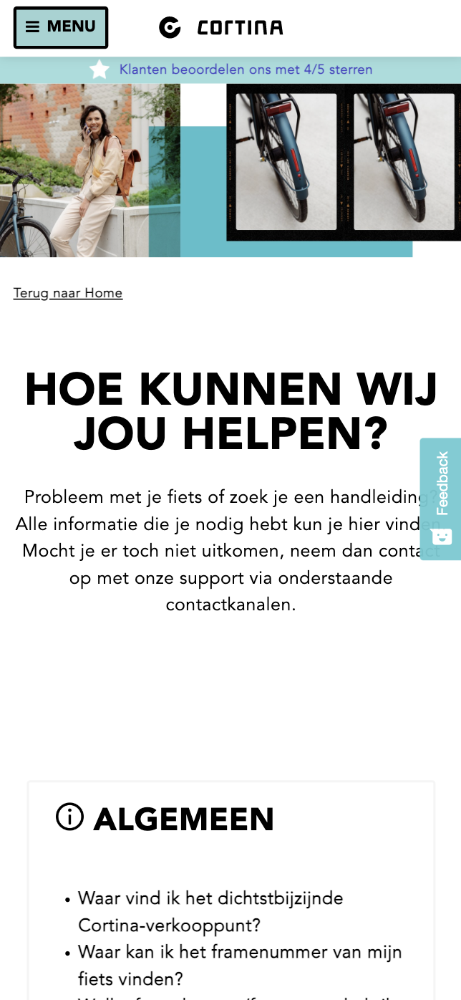
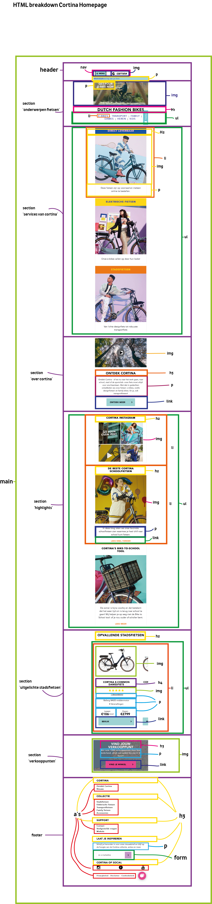

# Procesverslag
Markdown is een simpele manier om HTML te schrijven.  
Markdown cheat cheet: [Hulp bij het schrijven van Markdown](https://github.com/adam-p/markdown-here/wiki/Markdown-Cheatsheet).

Nb. De standaardstructuur en de spartaanse opmaak van de README.md zijn helemaal prima. Het gaat om de inhoud van je procesverslag. Besteedt de tijd voor pracht en praal aan je website.

Nb. Door *open* toe te voegen aan een *details* element kun je deze standaard open zetten. Fijn om dat steeds voor de relevante stuk(ken) te doen.

## Jij

  
uitwerken voor kick-off werkgroep

  ### Auteur:
  Finn Riksman

  #### Je startniveau:
  Blauw/rood

  #### Je focus:
  Surface plane
 

## Je website

  
uitwerken voor kick-off werkgroep

  ### Je opdracht:
  https://www.cortinafietsen.nl/

  #### Screenshot(s) van de eerste pagina (small screen): 
  Home page Cortina
    

  #### Screenshot(s) van de tweede pagina (small screen):
  Support pagina
  
 

## Toegankelijkheidstest 1/2 (week 1)

  
uitwerken na test in 1e werkgroep

  ### Bevindingen
  Lijst met je bevindingen die in de test naar voren kwamen:
  - Alle headings zijn een H2, en een paar H3. Dit geeft geen hiërarchie. Een paar H2's zijn  zelfs anders weergegeven. 
  - Op de winkels pagina worden de locaties op de map in een random volgorde aangeklikt. Niet op volgorde van positie en niet op cijfers.
  - Bij sommige links kun je niet zien dat deze aangeklikt staat. Er is niets dat de focus laat zien. 
  - Soms, vooral op producten pagina's, navigeert de tab op een rare random volgorde door de pagina heen.

  #### Screenreader
  Hier korte omschrijving (met indien nodig afbeeldingen)
  - Wat hierbij het grootste probleem is, is dat de code zelf geen goede hiërarchie heeft. Er zijn heel veel headings die H2 zijn, ookal is de vormgeving hiervan soms anders. Er zijn geen H1 headings. En helemaal GEEN headings op de beginpagina. Waardoor iemand met een VoiceOver niet door de pagina kan gaan omdat ze niet weten wat hier mogelijk is. 

  Hier een omschrijving van hoe het opgelost kan worden (met indien nodig afbeeldingen)
  - Om hiermee een grote verbetering te maken is een nette code, HTML. Een goede hiërarchie, waardoor mensen met een VoiceOver ten minste weten welke dingen mogelijk zijn op de website. Ook het gebruik van meerdere headings in de HTML zal hierbij helpen. Zo kan de pagina worden onderverdeeld in relevante info tot minder relevant. 

  #### Muis en Toetsenbord 
  Hier korte omschrijving (met indien nodig afbeeldingen)
  - Opzich was het tabben niet heel erg. Maar op sommige momenten ging het wel fout. Bijvoorbeeld op de home page zijn bij een paar linkjes geen focus states zichtbaar. Hierdoor kun je niet weten waar je bent op de pagina. Ook op andere pagina's is de volgorde van navigeren niet logisch. Het is niet van boven naar beneden, links naar rechts. Maar compleet random. Dus dan boven, daarna beneden, onder, daar, hier, het slaat nergens op. Het is dus altijd maar afwachten of de volgende tab landt op de link waar je heen wilt. 

  Hier een omschrijving van hoe het opgelost kan worden (met indien nodig afbeeldingen)
  - Een goede focus state. En weer een nette HTML, op logische volgorde. Dit zou beide dingen veel verhelpen. 

  #### Motoriek (shocks, elastiekjes)
  Hier korte omschrijving (met indien nodig afbeeldingen)
  - Met de spasmes aan mijn arm was het in het algemeen moeilijk om de computer te bedienen. Ik klikte vaak met 2 vingers terwijl ik dit niet bedoelde waardoor dat menu'tje opende met hierin kopiëren enzo. De buttons waren wel groot genoeg om met spasmes toe te kunnen navigeren. Dat was een pluspunt. Verder was het niet lastig om met twee vingers aan elkaar de website te gebruiken. Dat ging gewoon prima. 

  Hier een omschrijving van hoe het opgelost kan worden (met indien nodig afbeeldingen)
   - Misschien wat grotere raakvlakken voor links en buttons, zodat het iets makkelijker wordt voor de gebruiker om door de website te navigeren. 

  #### Visueel (brillen, contrast, kleurenblind, dark/light). 
  Hier korte omschrijving (met indien nodig afbeeldingen)
  - Door de veel kleurgebruik en duidelijke grote headings was het wel OK om met wazig beeld door de website te navigeren. Alleen de kleine tekst was soms te onduidelijk. Maar dat kan een slechtziende uiteraard aanpassen in hun eigen computersysteem. 

  Hier een omschrijving van hoe het opgelost kan worden (met indien nodig afbeeldingen)
  - Rekening houden in de code met properties die zich aanpassen op de voorkeuren van de gebruiker in hun laptop. 

## Breakdownschets (week 1)

  
uitwerken na afloop 2e werkgroep

  ### de hele pagina: 
  

## Voortgang 1 (week 2)

  
uitwerken voor 1e voortgang

  ### Stand van zaken
  Ik vond het eigenlijk erg goed gaan voor de eerste keer weer coderen in een paar maanden! Bij het meeste wist ik wel welke richting ik op moest en dmv de opdrachten van flexbox, grid, etc was dit nog fijner. Uiteraard liep, en loop, ik nog tegen wat dingetjes aan maar ik vraag dit altijd aan de klas of aan Vasilis. Waar dan een oplossing uit komt die ik zeker snap! 

  ### Agenda voor meeting
  samen met je groepje opstellen

  | student 1      | student 2          | student 3    | student 4        |
  | ---            | ---                | ---          | ---              |
  | In de list items margin/padding? | en dit             | en ik dit    | en dan ik dat    |
  | responsiveness fixen UL en witte header tekst in foto | dit als er tijd is | nog een punt | dit wil ik zeker |
  | ...            | ...                | ...          | ...              |

  ### Verslag van meeting
  hier na afloop snel de uitkomsten van de meeting vastleggen

  - html is goed
  - article moet section worden
  - er hoeft geen desktop versie gemaakt te worden
  - moet flexbox worden en dan align items
  - mag maar 1 H1 op pagina. 

## Voortgang 2 (week 3)

  
uitwerken voor 2e voortgang

  ### Stand van zaken
  Deze week heb ik vooral de hele pagina afgemaakt en ben ik begonnen met de details. Wat goed ging! Als iets niet werkte kon ik eruit komen met de uitleg.  

  ### Agenda voor meeting

  | student 1      | student 2          | student 3    | student 4        |
  | ---            | ---                | ---          | ---              |
  | formuliertjes (zoek + footer)  | en dit             | en ik dit    | en dan ik dat    |
  | carroussel flexboxen | dit als er tijd is | nog een punt | dit wil ik zeker |
  | image zwarte opacity, zwart blokje??             | ...                | ...          | ...              |

  ### Verslag van meeting
  hier na afloop snel de uitkomsten van de meeting vastleggen

  - form uitleg gehad, formulier = label + input, daarnaast button. 
  - label input connecten voor UX 
  - na invullen ander invulveldje, groen ofzo
  - a om image achtergrond zwart doen 
  - maak van a in carroussel een flexbox. 
  - maak van h5's buttons!!
- ...

## Toegankelijkheidstest 2/2 (week 4)

  
uitwerken na test in 8e werkgroep

  ### Bevindingen
  Lijst met je bevindingen die in de test naar voren kwamen (geef ook aan wat er verbeterd is):

  #### Screenreader
  Hier korte omschrijving (met indien nodig afbeeldingen)
  - button waar '>' wordt gebruikt wordt uitgesproken als 'groter dan'. Hoe fix ik dit??
  - Links, omdat in sommige 'a' tags meerdere dingen zitten worden bv de foto's ook voorgelezen. Is dit ok? Of raar? 

  Hier een omschrijving van hoe het opgelost kan worden (met indien nodig afbeeldingen)
  - Regel schrijven waardoor '>' niet wordt opgelezen door de screenreader. 

  #### Muis en Toetsenbord 
  Hier korte omschrijving (met indien nodig afbeeldingen)
  - In het begin tabben ga je eerst door de ontzichtbare navigatie heen. 
  - Headings goed gestructureerd. 
  - Links, omdat in sommige 'a' tags meerdere dingen zitten, die staan dan opgesomt achter de link. 

  Hier een omschrijving van hoe het opgelost kan worden (met indien nodig afbeeldingen)
  - Een regel coderen waarin je niet meteen naar het navigatie menu gaat?? 
  - Is hier een regel voor die dit kan voorkomen? Of is dit juist handig. 

  #### Motoriek (shocks, elastiekjes)
  Hier korte omschrijving (met indien nodig afbeeldingen)
  - Alle buttons en interactieve plekken zijn groot genoeg. 

  Hier een omschrijving van hoe het opgelost kan worden (met indien nodig afbeeldingen)

  #### Visueel (brillen, contrast, kleurenblind, dark/light). 
  Hier korte omschrijving (met indien nodig afbeeldingen)
  - Met kleurenblindheid is de hover van de menu button (bijna) niet zichtbaar. 

  Hier een omschrijving van hoe het opgelost kan worden (met indien nodig afbeeldingen)
  - Andere kleur hover met hoger contrast tussen de kleuren of een visueel ding bij de hover, zoals een underline.

## Voortgang 3 (week 4)

  
uitwerken voor 3e voortgang

  ### Stand van zaken
  hier dit ging goed & dit was lastig (neem ook screenshots op van delen van je website en code)
  Het volledig maken van de website ging erg soepel nogmaals. Ik dacht dat ik het aardig goed toegankelijk had ook, maar bij de test vielen sommige dingen wat tegen waarvan ik dan niet weet hoe ik dat kan oplossen. Dat vind ik bij dit laatste voortgangsgesprek het belangrijkste ook. 

  ### Agenda voor meeting
  samen met je groepje opstellen

  | student 1      | student 2          | student 3    | student 4        |
  | ---            | ---                | ---          | ---              |
  | De dingen uit de toegankelijkheidstest die niet werkten.  | en dit             | en ik dit    | en dan ik dat    |
  | Images op de tweede pagina, waarom niet zichtbaar??  | dit als er tijd is | nog een punt | dit wil ik zeker |
  | Opvallende stadsfietsen niet goed: layout. Maar ook met tabben is de a kleiner dan de li waardoor ze overlappen. Hoe fix je dit?             | ...                | ...          | ...              |

  ### Verslag van meeting
  hier na afloop snel de uitkomsten van de meeting vastleggen

  - focus within, = focus op li als de A wordt gefocust. 
  - oplezen van alles in de A niet veranderen. 
  - span + aria-hidden = true voor het niet voorlezen van de '>' icoon bij de screenreader. 
  - height 100%, space-evenly, daarna sections in de li doen die bij elkaar moeten blijven. 

## Eindgesprek (week 5)

  
uitwerken voor eindgesprek

  ### Je uitkomst - karakteristiek screenshots:
  

  ### Dit ging goed/Heb ik geleerd: 
  Korte omschrijving met plaatjes

  

  ### Dit was lastig/Is niet gelukt:
  Korte omschrijving met plaatjes

  

## Bronnenlijst

  
continu bijhouden terwijl je werkt

  Nb. Wees specifiek ('css-tricks' als bron is bijv. niet specifiek genoeg).

  1. https://css-tricks.com/snippets/css/a-guide-to-flexbox/ 
  2. Hamburger Menu: https://codepen.io/shooft/pen/GRxXboQ
  3. Voor als ik even hulp nodig had met grid: https://cssgridgarden.com/#nl 
  4. Voor als ik even hulp nodig had met flexbox: https://flexboxfroggy.com/#nl
  5. Vasilis en Ymaro :) 
  

